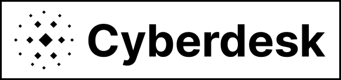

<p align="center">
  
</p>

<p align="center">
  <b>The open source infra for virtual desktop orchestration, tailored for computer agents</b>
</p>

<p align="center">
  <!-- NPM Version -->
  <a href="https://www.npmjs.com/package/cyberdesk">
    
  </a>
  <!-- NPM Downloads -->
  <a href="https://www.npmjs.com/package/cyberdesk">
    
  </a>
  <!-- PyPI Version -->
  <a href="https://pypi.org/project/cyberdesk/">
    
  </a>
  <!-- PyPI Downloads -->
  <a href="https://pypi.org/project/cyberdesk/">
    
  </a>
</p>
<p align="center">
  <!-- Discord -->
  <a href="https://discord.gg/ws5ddx5yZ8">
    
  </a>
  <!-- License -->
  <a href="LICENSE">
    
  </a>
  <!-- GitHub Stars (optional) -->
  <a href="https://github.com/cyberdesk-hq/cyberdesk">
    
  </a>
</p>

<p align="center">
  
  <br>
  <i>A computer agent operating a Cyberdesk virtual desktop from a user prompt</i>
</p>

---

## 🚀 Quick Start

### TypeScript

```bash
npm install cyberdesk
```

```typescript
import { createCyberdeskClient } from 'cyberdesk';

const cyberdesk = createCyberdeskClient({ apiKey: 'YOUR_API_KEY' });
const launchResult = await cyberdesk.launchDesktop({ body: { timeout_ms: 10000 } });
const desktopId = launchResult.id;

// Take a screenshot
const screenshot = await cyberdesk.executeComputerAction({
  path: { id: desktopId },
  body: { type: 'screenshot' }
});

// Left click at (100, 150)
await cyberdesk.executeComputerAction({
  path: { id: desktopId },
  body: { type: 'click_mouse', x: 100, y: 150, button: 'left' }
});
```

### Python

```bash
pip install cyberdesk
```

```python
from cyberdesk import CyberdeskClient
from cyberdesk.actions import click_mouse, screenshot, ClickMouseButton

client = CyberdeskClient(api_key="YOUR_API_KEY")
result = client.launch_desktop(timeout_ms=10000)
desktop_id = result.id

# Take a screenshot
screenshot_action = screenshot()
screenshot_result = client.execute_computer_action(desktop_id, screenshot_action)

# Left click at (100, 150)
click_action = click_mouse(x=100, y=150, button=ClickMouseButton.LEFT)
client.execute_computer_action(desktop_id, click_action)
```

👉 For more details and advanced usage, see the [Quickstart Guide](https://docs.cyberdesk.io/docs/quickstart) and [Official Documentation](#-official-documentation).

---

## ✨ Features

<div align="center">

<table>
  <tr>
    <td align="center" width="260"><br><b>🚀 Fast Launch</b><br><sub>Spin up virtual desktops in seconds, ready for automation or remote use.</sub><br><br></td>
    <td align="center" width="260"><br><b>🖱️ Full Automation</b><br><sub>Control mouse, keyboard, and more—perfect for computer agents.</sub><br><br></td>
    <td align="center" width="260"><br><b>🖥️ Cloud Native</b><br><sub>Runs on AKS, or self-hosted on your own infrastructure.</sub><br><br></td>
  </tr>
  <tr>
    <td align="center" width="260"><br><b>🔒 Secure & Auditable</b><br><sub>Session logs, API keys, and enterprise-grade security.</sub><br><br></td>
    <td align="center" width="260"><br><b>🧩 Type-Safe SDKs</b><br><sub>Official Python & TypeScript SDKs with full type hints.</sub><br><br></td>
    <td align="center" width="260"><br><b>🤖 AI-Ready</b><br><sub>Tailor built for the next generation of computer use agents</sub><br><br></td>
  </tr>
</table>

</div>

---

## 📚 Official Documentation

- [Quickstart Guide](https://docs.cyberdesk.io/docs/quickstart)
- [API Reference](https://docs.cyberdesk.io/docs/api-reference)
- [TypeScript SDK](sdks/ts-sdk/README.md)
- [Python SDK](sdks/py-sdk/README.md)

---

## 🛠️ Project Structure

### /apps
- **web**: Landing page and dashboard ([README](apps/web/README.md))
- **api**: Developer-facing API ([README](apps/api/README.md))
- **docs**: Documentation site ([README](apps/docs/README.md))

### /services
- **cyberdesk-operator**: Kubernetes operator for managing Cyberdesk Custom Resources, and starting/stopping Kubevirt virtual machines ([README](services/cyberdesk-operator/README.md))
- **gateway**: HTTP service that proxies requests to the Kubevirt API, and routes them to the correct virtual machine ([README](services/gateway/README.md))

### /sdks
- **ts-sdk**: TypeScript SDK ([README](sdks/ts-sdk/README.md))
- **py-sdk**: Python SDK ([README](sdks/py-sdk/README.md))

### /infrastructure
- **terraform**: AKS Cluster Setup (Terraform) ([README](infrastructure/README.md))
- **kubernetes**: Kubernetes resources for the Cyberdesk operator

---

## 🤝 Contributing

We welcome contributions!
- Join the [Discord](https://discord.gg/ws5ddx5yZ8) for discussion and support
- Get a personal 1-1 walkthrough of how to self host the project by contacting us on [Discord](https://discord.gg/ws5ddx5yZ8)

---

## 📣 Community & Support

- [Discord](https://discord.gg/ws5ddx5yZ8) for help and chat
- [Good First Issues](https://github.com/cyberdesk-hq/cyberdesk/issues?q=is%3Aissue+is%3Aopen+label%3A%22good+first+issue%22)
- [Open an Issue](https://github.com/cyberdesk-hq/cyberdesk/issues)

---

## 💡 Philosophy

> At **Cyberdesk** our mission is to make building computer agents as easy as playing with legos. We believe in open, simple, and extensible tools for the new generation of developers: *computer agent developers*.

---

## 📄 License

Apache License 2.0. See [LICENSE](LICENSE).

---

<p align="center">
  <sub>Made with ❤️ by the Cyberdesk Team</sub>
</p>
